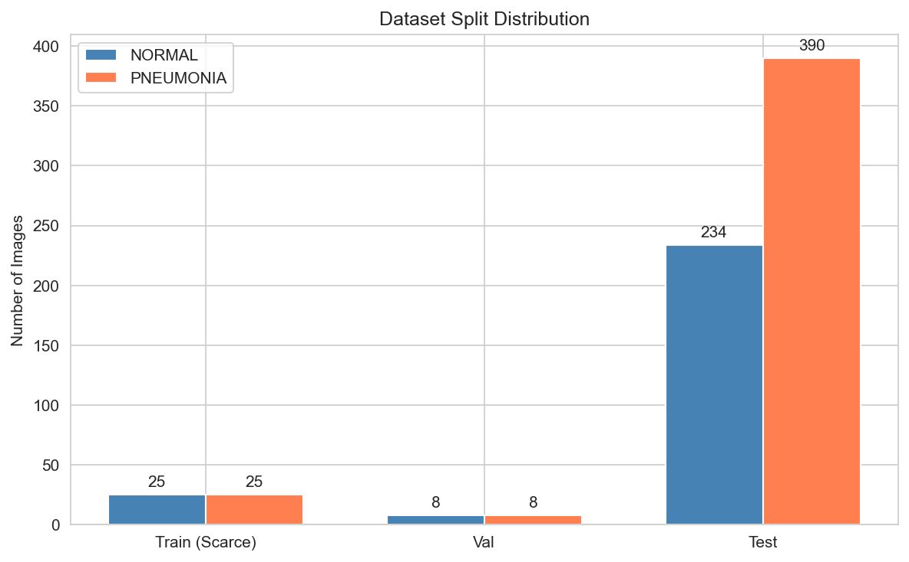
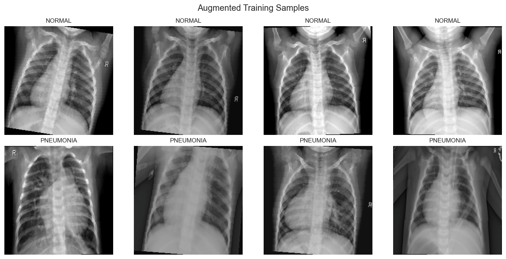
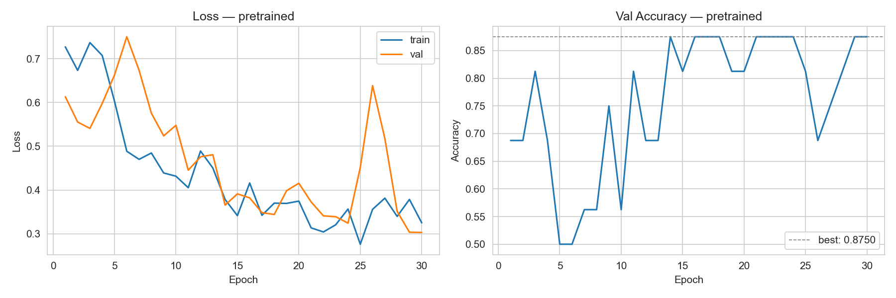
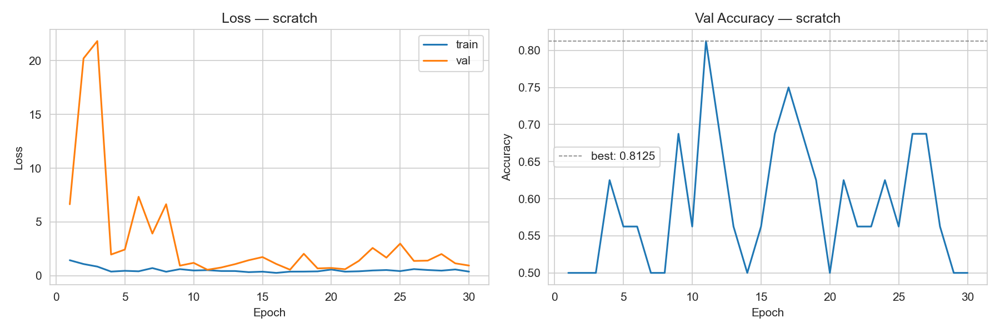
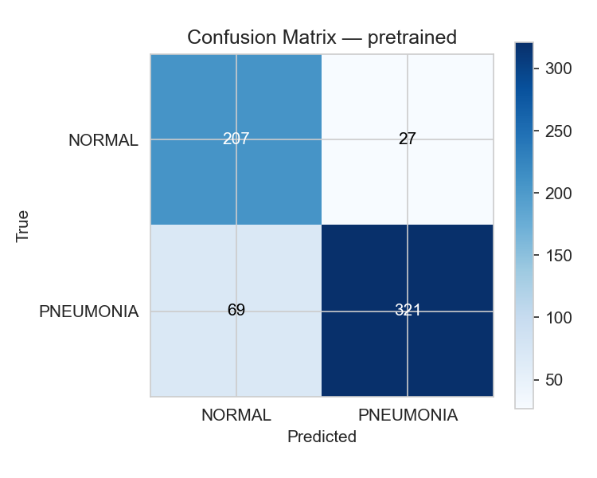
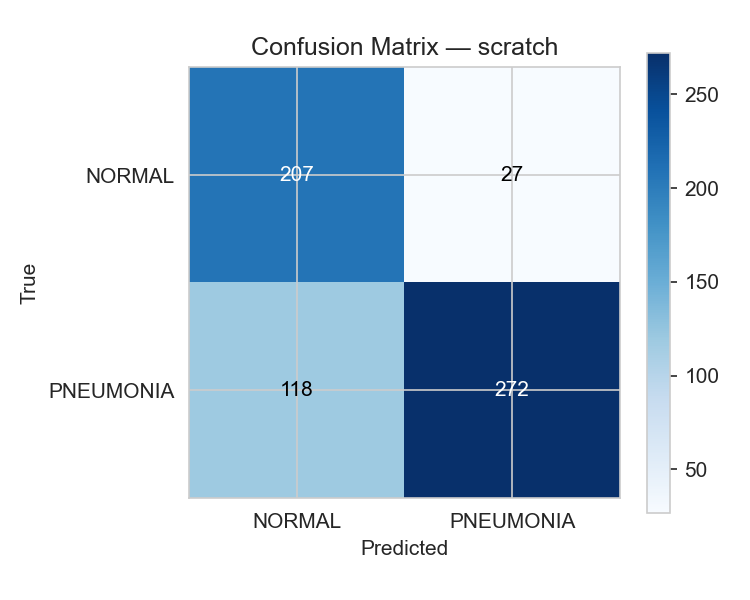
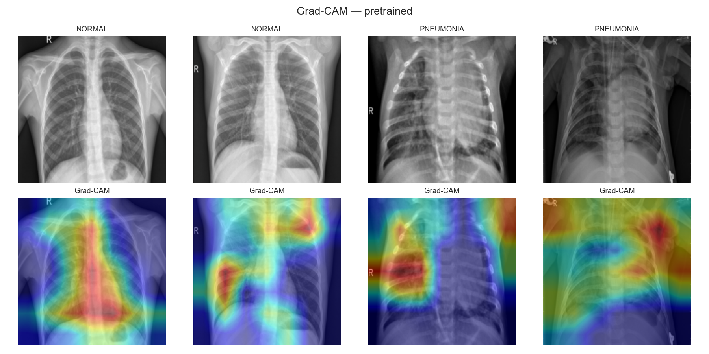
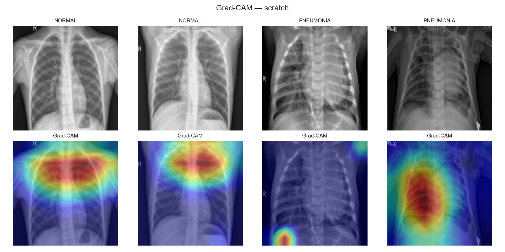

# 🫁 Transfer Learning vs. Training from Scratch

**Can ImageNet pre-trained weights achieve clinical-grade pneumonia detection with only 50 training images?**

A controlled experiment on chest X-ray classification under extreme data scarcity — comparing a frozen ResNet18 backbone against a randomly-initialised ResNet18 trained on identical data.

---

## Hypothesis

| Model                            | Weight Init                           | Trainable Params          | Predicted Accuracy                   |
| -------------------------------- | ------------------------------------- | ------------------------- | ------------------------------------ |
| **Transfer Learning** (ResNet18) | ImageNet pre-trained, backbone frozen | **1,026** (FC head only)  | **> 80 %**                           |
| **From Scratch** (ResNet18)      | Kaiming random                        | **~11.18 M** (all layers) | **~50 %** (chance-level overfitting) |

**Why it matters:** If a frozen ResNet18 head — with only 1,026 learnable parameters — achieves >80 % on 624 test images after training on just 50 examples, it validates few-shot transfer learning as a practical strategy for data-scarce healthcare settings.

---

## Key Results

Combined metrics (from your provided comparison figure):

| Metric               | Pretrained | From Scratch |    Δ    | Winner     |
| -------------------- | :--------: | :----------: | :-----: | ---------- |
| **Accuracy**         |   0.8221   |    0.6619    | +0.1602 | Pretrained |
| **Precision**        |   0.8233   |    0.6565    | +0.1668 | Pretrained |
| **Recall**           |   0.8449   |    0.5722    | +0.2727 | Pretrained |
| **F1 (macro)**       |   0.8195   |    0.5482    | +0.2713 | Pretrained |
| **AUC-ROC**          |   0.9345   |    0.6786    | +0.2559 | Pretrained |
| **Val Acc (mean)**   |   0.7292   |    0.5479    | +0.1813 | Pretrained |
| **Val Acc (median)** |   0.7500   |    0.5625    | +0.1875 | Pretrained |
| **Stability**        |   2.0641   |    0.8960    | +1.1681 | Pretrained |

---

## Dataset Exploration Outputs

### Class Distribution



### Augmented Samples



---

## Learning Curves

### Transfer Learning (Pretrained)



### From Scratch



**Reading the curves:**

- **Pretrained** — val accuracy lifts quickly and stabilises; train/val loss converge. The frozen backbone prevents overfitting with only 1,026 trainable parameters.
- **Scratch** — train loss collapses toward zero while val loss diverges upward — the textbook overfitting signature of 11 M parameters fitted to 50 examples.

---

## Confusion Matrices

|                            Transfer Learning                            |                           From Scratch                            |
| :---------------------------------------------------------------------: | :---------------------------------------------------------------: |
|  |  |

**Medical context:** The bottom-left cell (False Negative) represents missed pneumonia — the most dangerous error. A low FN count in the pretrained matrix is the primary clinical signal.

---

## Grad-CAM Visualisations

### Transfer Learning



### From Scratch



**Interpretation:**

- **Pretrained** — activation focused on lung fields, consolidation regions, and areas of opacity consistent with radiological pneumonia markers.
- **Scratch** — scattered, diffuse activations with no anatomical coherence; the network has not learned any meaningful spatial representations from 50 images.

---

## Dataset

**Source:** [Chest X-Ray Images (Pneumonia) — Kaggle](https://www.kaggle.com/datasets/paultimothymooney/chest-xray-pneumonia)  
**Author:** Paul Mooney (Kermany et al., _Cell_ 2018)

| Split              | NORMAL | PNEUMONIA | Total  |
| ------------------ | :----: | :-------: | :----: |
| **Train (scarce)** |   25   |    25     | **50** |
| Val                |   8    |     8     |   16   |
| Test               |  234   |    390    |  624   |

The scarce training set is a stratified 25 + 25 sample drawn from the original 5,216-image Kaggle train split (`seed=42`, fully deterministic).

---

## Setup & Reproduction

### 1. Clone & install

```bash
git clone https://github.com/<your-username>/xray-classifier.git
cd xray-classifier
pip install -r requirements.txt
```

### 2. Download the dataset

```bash
# Requires kaggle CLI configured with your API token
kaggle datasets download -d paultimothymooney/chest-xray-pneumonia
unzip -q chest-xray-pneumonia.zip -d data/raw/
```

### 3. Sample the scarce training set

```python
from src.data import sample_scarce, verify_scarce
sample_scarce(seed=42)   # copies 25+25 images to data/scarce/train/
verify_scarce()
```

### 4. Train both models

```bash
python -m src.train   # trains pretrained + scratch, saves checkpoints/
```

### 5. Evaluate & generate plots

```bash
python -m src.evaluate  # saves outputs/*.png + outputs/pretrained_metrics.json + outputs/scratch_metrics.json
```

### 6. Open the report notebook

```bash
jupyter notebook notebook.ipynb
```

Run all cells top-to-bottom (`Kernel → Restart & Run All`). All plots are loaded from `outputs/`; metrics are computed from model predictions in the notebook.

---

## Project Structure

```
xray-classifier/
├── notebook.ipynb          # final experiment report
├── requirements.txt
├── src/
│   ├── data.py             # dataset sampling, transforms, DataLoaders
│   ├── models.py           # build_pretrained() / build_scratch() / count_params()
│   ├── train.py            # training loop, Adam, 30 epochs, checkpoint saving
│   └── evaluate.py         # metrics, confusion matrices, learning curves, Grad-CAM
├── data/
│   ├── raw/                # [git-ignored] full Kaggle dataset
│   └── scarce/             # [git-ignored] 50-image stratified subset
├── checkpoints/            # [git-ignored] best model weights + history JSON
└── outputs/                # plots + per-model metrics JSON files
```

---

## Tech Stack

| Tool                 | Version | Purpose                                             |
| -------------------- | ------- | --------------------------------------------------- |
| Python               | 3.10+   | Core language                                       |
| PyTorch              | 2.3+    | Model training, Grad-CAM gradient hooks             |
| torchvision          | 0.18+   | ResNet18 architecture, ImageNet weights, transforms |
| scikit-learn         | 1.4+    | Accuracy, F1, AUC-ROC, confusion matrix             |
| pandas               | 2.0+    | Metrics display table in notebook                   |
| matplotlib / seaborn | —       | All plots                                           |
| Jupyter              | —       | Report notebook                                     |
| Kaggle API           | —       | Dataset download                                    |

---

## References

1. Kermany, D.S. et al. (2018). _Identifying Medical Diagnoses and Treatable Diseases by Image-Based Deep Learning._ Cell, 172(5), 1122–1131.
2. He, K. et al. (2016). _Deep Residual Learning for Image Recognition._ CVPR. [arXiv:1512.03385](https://arxiv.org/abs/1512.03385)
3. Selvaraju, R.R. et al. (2017). _Grad-CAM: Visual Explanations from Deep Networks._ ICCV. [arXiv:1610.02391](https://arxiv.org/abs/1610.02391)
4. Raghu, M. et al. (2019). _Transfusion: Understanding Transfer Learning for Medical Imaging._ NeurIPS. [arXiv:1902.07208](https://arxiv.org/abs/1902.07208)
